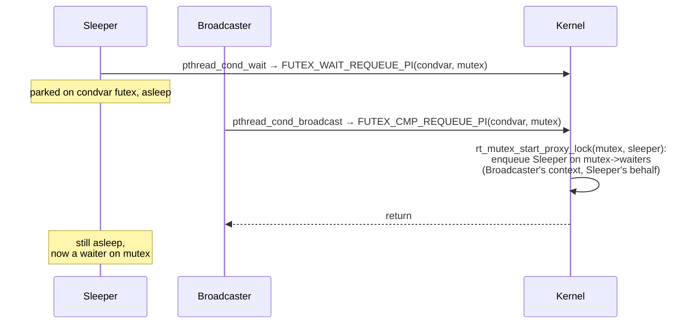
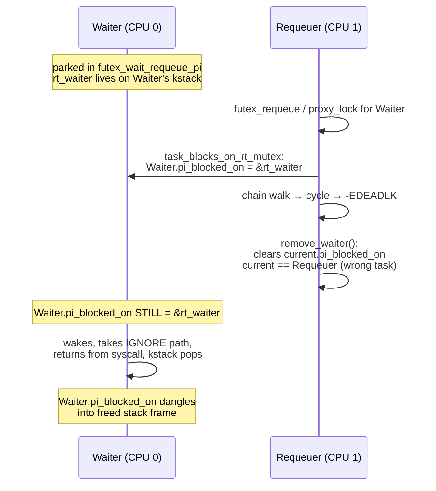
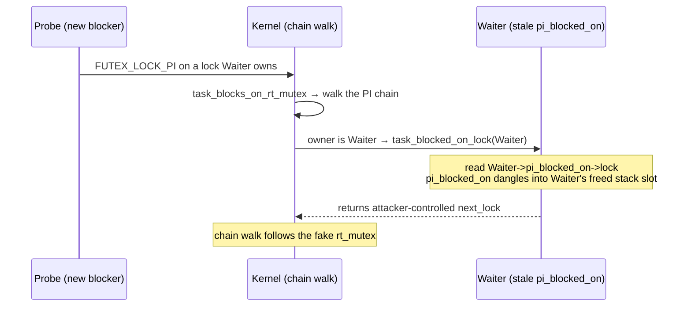

# futex: remove_waiter stack uaf

Following my last post on [the requeue_pi_wake_futex ](futex) I kept staring at the same code. 
If you need more information about futex, I encourage you to read my previous post, [Elon's towleroot posts](https://elongl.github.io/exploitation/2021/01/08/cve-2014-3153.html) and futex internals.
PI futex requeue is one of those weird kernel wizards where a single helper has two completely different kinds of callers: the task itself on the slowlock path, and *somebody else* acting on the task's behalf on the proxy path. 
Any time you see `current` variable referenced inside a helper that's reachable from both, you're looking at a candidate bug.

So I tried my luck :')
I once again ask you to read your internals about the futex subsystem before diving into this post. 
I found one candidate in the cleanup path of `rt_mutex_start_proxy_lock` that fits the pattern exactly, it was fixed upstream Thomas himself, in commit
[`3bfdc63936dd`](https://github.com/torvalds/linux/commit/3bfdc63936dd) "rtmutex: Use waiter::task instead of current in remove_waiter()".

The bug is a stack uaf, `task_struct->pi_blocked_on` gets left pointing at a `struct rt_mutex_waiter` that lives on the waiter task's kernel stack.
When the waiter returns from its syscall the stack frame is popped, but `pi_blocked_on` keeps pointing at the slot and the slot's bytes are immediately reusable by the task's next syscall. 
Any future PI chain walk through the task dereferences the dangling pointer. 
I fiddled a bit with this bug.

## rt_mutex and PI futexes in 30 seconds


A PI futex is a futex with an rt_mutex stapled to it. The userspace word holds the owner TID the kernel-side `struct futex_pi_state` wraps an `rt_mutex_base` and keeps it in
sync with the user word.

`rt_mutex` is the kernel's priority inheritance mutex implementation.
When a high priority waiter blocks on a lock held by a lower priority owner, the owner gets boosted to the waiter's
priority until it releases. The boost walks the chain: if the owner is itself waiting on another lock, that lock's owner gets boosted too, all the way until we hit a runnable task. 
Honestly, `rt_mutex_adjust_prio_chain` — this code is very complex and I had a very hard time reading it, to this day I don't understand it.

This is where the proxy pattern enters. `FUTEX_CMP_REQUEUE_PI` is the op that `pthread_cond_broadcast` and `pthread_cond_signal` use under the hood. 
Their POSIX declarations:

```c
#include <pthread.h>

int pthread_cond_broadcast(pthread_cond_t *cond);
int pthread_cond_signal(pthread_cond_t *cond);
```

`pthread_cond_broadcast` unblocks all threads waiting on the condvar, `pthread_cond_signal` unblocks at least one.
Under the hood glibc's NPTL (`nptl/pthread_cond_signal.c`) maps these onto the futex syscall:

```c
/* include/uapi/linux/futex.h */
#define FUTEX_WAIT_REQUEUE_PI   11
#define FUTEX_CMP_REQUEUE_PI    12
```

`FUTEX_WAIT_REQUEUE_PI` is the waiter side — sleep on the condvar futex, expecting to be requeued onto a PI mutex later.
`FUTEX_CMP_REQUEUE_PI` is the broadcaster side — atomically move waiters from the condvar to the PI mutex.

A thread that called `pthread_cond_wait` is asleep on the condvar's futex. When somebody calls broadcast, the kernel has to move that sleeper onto the condvar's associated PI mutex's wait queue without waking it first.
The broadcasting thread does that work, in its own context, on the sleeper's behalf:



The kernel helper for "do an rt_mutex enqueue on another sleeping task's behalf" is `rt_mutex_start_proxy_lock`:

```c
int rt_mutex_start_proxy_lock(struct rt_mutex_base *lock,
                              struct rt_mutex_waiter *waiter,
                              struct task_struct *task)
{
    int ret;
    raw_spin_lock_irq(&lock->wait_lock);
    ret = __rt_mutex_start_proxy_lock(lock, waiter, task);
    if (unlikely(ret))
        remove_waiter(lock, waiter);
    raw_spin_unlock_irq(&lock->wait_lock);
    return ret;
}
```

`task` is the waiter, passed explicitly. `current` is whoever is calling the requeuer in the futex path. 
The whole story is what happens when `task != current` and the cleanup code forgets which one it's supposed to be touching.

---

## Triggering

This is confusing and techie, so bear with me. I hope the drawing can help you.
In order to trigger this bug we spawn (at least) three threads with two PI futexes:

- `Holder` owns the `target` rt_mutex (the one behind `uaddr2`).
- `Waiter` owns a second PI futex called `other`.
- `Holder` is blocked on `other` so the kernel's PI graph already knows "Holder wants other, owned by Waiter".
- `Waiter` is parked in `FUTEX_WAIT_REQUEUE_PI(uaddr1, ..., uaddr2)`, sleeping until somebody moves it onto `target`.
- `Requeuer` calls `FUTEX_CMP_REQUEUE_PI(uaddr1, ..., uaddr2)` to do the move.

When the kernel enqueues Waiter on `target` and walks the PI chain `Waiter → target → Holder → other → Waiter` it spots the cycle, 
returns `-EDEADLK` and that's the path that calls `remove_waiter()` with the wrong `current`.



A few moments later any other thread (`Probe`) that blocks on a lock Waiter owns will trigger the chain walker to call `task_blocked_on_lock(Waiter)` which dereferences `Waiter.pi_blocked_on->lock`.
The shtick is that the address itself is still valid because the Waiter's stack is allocated for as long as Waiter is alive but the data isn't `rt_mutex_waiter` :') 
That frame got popped when Waiter returned from `futex_wait_requeue_pi`, and the same stack region is now scratch space for whatever syscall Waiter has run since, this is crucial to understand and remember. 
Here's how these structures actually look (`pahole`, v6.6.138, x86_64):

```
struct rt_mutex_waiter {
    struct rt_waiter_node  tree;           /*     0    40 */
    struct rt_waiter_node  pi_tree;        /*    40    40 */
    struct task_struct *   task;           /*    80     8 */
    struct rt_mutex_base * lock;           /*    88     8 */  /* ← the UAF read */
    unsigned int           wake_state;     /*    96     4 */
    /* 4 bytes hole */
    struct ww_acquire_ctx * ww_ctx;        /*   104     8 */

    /* size: 112, cachelines: 2 */
};

struct rt_mutex_base {
    raw_spinlock_t         wait_lock;      /*     0     4 */
    /* 4 bytes hole */
    struct rb_root_cached  waiters;        /*     8    16 */
    struct task_struct *   owner;          /*    24     8 */

    /* size: 32 */
};
```

The chain walker dereferences these bytes as if they were still a `struct rt_mutex_waiter` and takes the `lock` field at offset 88, and that becomes the `next_lock` it follows  :')
Spray the Waiter's "next syscall" at one whose kernel frame plants attacker bytes at the rt_waiter offset, and you control what the chain walker reads.
You need an infoleak to win here, or be smarter in turning this bug into an infoleak primitive.


```c
int __rt_mutex_start_proxy_lock(struct rt_mutex_base *lock,
                                struct rt_mutex_waiter *waiter,
                                struct task_struct *task)
{
    int ret;
    lockdep_assert_held(&lock->wait_lock);

    if (try_to_take_rt_mutex(lock, task, NULL))
        return 1;

    ret = task_blocks_on_rt_mutex(lock, waiter, task, NULL,
                                  RT_MUTEX_FULL_CHAINWALK);

    if (ret && !rt_mutex_owner(lock)) {
        /* the owner went away while we were chain walking — call it success */
        ret = 0;
    }

    return ret;
}
```

The interesting call is `task_blocks_on_rt_mutex` when `FULL_CHAINWALK` is set, several things happen:

1. Set `task->pi_blocked_on = waiter` and `waiter->task = task`.
2. Enqueue the waiter into `lock->waiters` (rbtree).
3. Walk the PI chain, if a cycle is detected return `-EDEADLK`.

Step 1 is where the dangling pointer originates. Step 3 is where it goes wrong.

When the chain walk returns `-EDEADLK`, the wrapper takes the cleanup branch (v6.6.138, `kernel/locking/rtmutex_api.c:339`):

```c
int __sched rt_mutex_start_proxy_lock(struct rt_mutex_base *lock,
				      struct rt_mutex_waiter *waiter,
				      struct task_struct *task)
{
	int ret;

	raw_spin_lock_irq(&lock->wait_lock);
	ret = __rt_mutex_start_proxy_lock(lock, waiter, task);
	if (unlikely(ret))
		remove_waiter(lock, waiter);
	raw_spin_unlock_irq(&lock->wait_lock);

	return ret;
}
```

and calls `remove_waiter` (v6.6.138, `kernel/locking/rtmutex.c:1515`):

```c
static void __sched remove_waiter(struct rt_mutex_base *lock,
				  struct rt_mutex_waiter *waiter)
{
	bool is_top_waiter = (waiter == rt_mutex_top_waiter(lock));
	struct task_struct *owner = rt_mutex_owner(lock);
	struct rt_mutex_base *next_lock;

	lockdep_assert_held(&lock->wait_lock);

	raw_spin_lock(&current->pi_lock);
	rt_mutex_dequeue(lock, waiter);
	current->pi_blocked_on = NULL;
	raw_spin_unlock(&current->pi_lock);

	/*
	 * Only update priority if the waiter was the highest priority
	 * waiter of the lock and there is an owner to update.
	 */
	if (!owner || !is_top_waiter)
		return;

	raw_spin_lock(&owner->pi_lock);

	rt_mutex_dequeue_pi(owner, waiter);

	if (rt_mutex_has_waiters(lock))
		rt_mutex_enqueue_pi(owner, rt_mutex_top_waiter(lock));

	rt_mutex_adjust_prio(lock, owner);

	/* Store the lock on which owner is blocked or NULL */
	next_lock = task_blocked_on_lock(owner);

	raw_spin_unlock(&owner->pi_lock);

	/*
	 * Don't walk the chain, if the owner task is not blocked
	 * itself.
	 */
	if (!next_lock)
		return;

	/* gets dropped in rt_mutex_adjust_prio_chain()! */
	get_task_struct(owner);

	raw_spin_unlock_irq(&lock->wait_lock);

	rt_mutex_adjust_prio_chain(owner, RT_MUTEX_MIN_CHAINWALK, lock,
				   next_lock, NULL, current);

	raw_spin_lock_irq(&lock->wait_lock);
}
```

`current` here is the requeuer. We're locking the requeuer's `pi_lock` and clearing the requeuer's `pi_blocked_on`. 
The waiter's `pi_blocked_on` keeps pointing at the on-stack `rt_waiter` that the wrapper just dequeued.

When does this matter? When the waiter task returns from its syscall, its kernel stack rewinds. 
The `rt_waiter` is gone `task->pi_blocked_on` is now pointing into undefined memory :')

The fix is simple, but requires understanding this whole clusterfuck. They replace `current` with `waiter->task`:

```c
struct task_struct *waiter_task = waiter->task;
...
raw_spin_lock(&waiter_task->pi_lock);
rt_mutex_dequeue(lock, waiter);
waiter_task->pi_blocked_on = NULL;
raw_spin_unlock(&waiter_task->pi_lock);
```

---

## Gaining primitives

`pi_blocked_on` is read by anything that walks the PI chain through Waiter.

The most direct consumer is `task_blocked_on_lock`:

```c
static struct rt_mutex_base *task_blocked_on_lock(struct task_struct *p)
{
    return p->pi_blocked_on ? p->pi_blocked_on->lock : NULL;
}
```

Called from `task_blocks_on_rt_mutex` and `rt_mutex_adjust_prio_chain`. 
Everytime some new task (`Probe`) blocks on a rt_mutex whose owner is Waiter, the chain walk reads
`Waiter->pi_blocked_on->lock` to figure out where to walk next. That's the use-after-free read.



We can spray and grab this object. 
When Waiter returns, the stack rewinds without zeroing any variable. Waiter's next syscall starts from the same stack top and depending on the syscall, the
scratch space in that new frame overlaps the old `rt_waiter` slot with bytes the user supplies.

On a 6.6.138 build (`CONFIG_INIT_STACK_ALL_ZERO=y`, `CONFIG_VMAP_STACK=n`), the `lock` field of the on-stack `rt_waiter` lands at a fixed offset: `THREAD_TOP - 0x208`. The layout is deterministic per build.
I encourage you to shape your layout and land on this field, rest is up to you to continue :') 

I tested this on Qemu and on a Frankel device, here's the panic I received on Qemu:


```
BUG: KASAN: wild-memory-access in do_raw_spin_trylock+0x69/0x120
Read of size 4 at addr 1ffff1100167efa3 by task poc/61
CPU: 0 PID: 61 Comm: poc Not tainted 6.6.138 #4
Call Trace:
 <TASK>
 kasan_report+0xd8/0x110
 kasan_check_range+0x105/0x1b0
 do_raw_spin_trylock+0x69/0x120
 ? task_blocks_on_rt_mutex.constprop.0.isra.0+0x29d/0xb10
 _raw_spin_trylock+0x19/0x70
 rt_mutex_adjust_prio_chain.isra.0+0x120/0x1640
 task_blocks_on_rt_mutex.constprop.0.isra.0+0x390/0xb10
 __rt_mutex_start_proxy_lock+0x61/0xa0
 futex_lock_pi+0x31f/0x5a0
 do_futex+0xa6/0x230
 __x64_sys_futex+0x1b8/0x2b0
 do_syscall_64+0x39/0x90
 entry_SYSCALL_64_after_hwframe+0x78/0xe2
```

The call chain is exactly the chain walker reaching `Waiter->pi_blocked_on->lock->wait_lock`. 
KASAN flags it wild memory access because the freed-stack address has no shadow.

Same call chain on the non-KASAN build oopses at `_raw_spin_trylock` with the planted sentinel in the registers:

```
general protection fault, probably for non-canonical address 0x4141414141414141: 0000 [#1] PREEMPT SMP NOPTI
RIP: 0010:_raw_spin_trylock+0x10/0x50
RAX: 0000000000000078 RBX: ffff888043211040 RCX: 4141414141414141
RDX: 0000000000000001 RSI: 0000000000000400 RDI: 4141414141414141
R15: 4141414141414141
 rt_mutex_adjust_prio_chain+0x9a/0x8f0
 task_blocks_on_rt_mutex.constprop.0+0x1c4/0x3c0
 __rt_mutex_start_proxy_lock+0x4d/0x70
 futex_lock_pi+0x25d/0x480
```


---

## Unusual primitive ideas

The web is filled with a few `rt_mutex_base` exploitation techniques,  these are my thoughts. 
`rt_mutex_base` looks as follows:

```c
struct rt_mutex_base {
    raw_spinlock_t  wait_lock;   /* offset 0 */
    struct rb_root_cached waiters; /* offset 8..23 */
    struct task_struct *owner;   /* offset 24 */
};
```

If the chunk's first 4 bytes are zero (looks like an unlocked spinlock), the trylock succeeds and the walk proceeds reads `waiters` (rb tree), reads `owner` (next task to walk into). 
If they're non-zero, trylock fails and the walk exits cleanly.
If the address is unmapped, Probe (the task triggering the chain walk) takes a page fault, oopses, you die.

---

## The fix


```diff
 static void __sched remove_waiter(struct rt_mutex_base *lock,
                                   struct rt_mutex_waiter *waiter)
 {
+    struct task_struct *waiter_task = waiter->task;
     bool is_top_waiter = (waiter == rt_mutex_top_waiter(lock));
     struct task_struct *owner = rt_mutex_owner(lock);
     struct rt_mutex_base *next_lock;

     lockdep_assert_held(&lock->wait_lock);

-    raw_spin_lock(&current->pi_lock);
+    raw_spin_lock(&waiter_task->pi_lock);
     rt_mutex_dequeue(lock, waiter);
-    current->pi_blocked_on = NULL;
-    raw_spin_unlock(&current->pi_lock);
+    waiter_task->pi_blocked_on = NULL;
+    raw_spin_unlock(&waiter_task->pi_lock);
     ...
 }
```


---

## Conclusions

This is a very rare and interesting bug imo, a helper gets written first for the obvious caller, where "the task we're operating on" and `current` happen to
coincide. Later someone adds a proxy callsite a function that does the operation on behalf of *someone else* and the helper keeps reaching for `current` because nobody
flagged it. Lockdep is happy: it cares about the spinlock, not whose `pi_lock` it actually is. The function still does *something* when called, and
on the slowlock path that something is correct. It's only on the proxy path that the wrong `pi_lock` and the wrong `pi_blocked_on` quietly get written.

The previous bug in this same neighborhood the missing `READ_ONCE(q->task)` in `requeue_pi_wake_futex` was the same family. There "the task that owns the `q`" was
conflated with "the task currently reading `q`". Here it's "the task we're cleaning up after" conflated with "current". Both load assumptions, both invisible until you
ask the question explicitly. 

I find this bug pretty unusual and novel, to whoever managed to exploit this reliably :') Identifying the confused `current` in such a complex environment and triggering
this path to grab the object and reach an arbitrary is novel to me.

If anyone takes it further I'd love to hear your opinion about this bug.
I hope you enjoyed this post.
