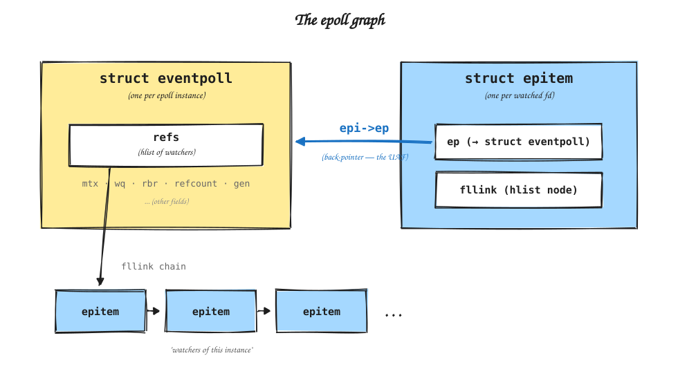
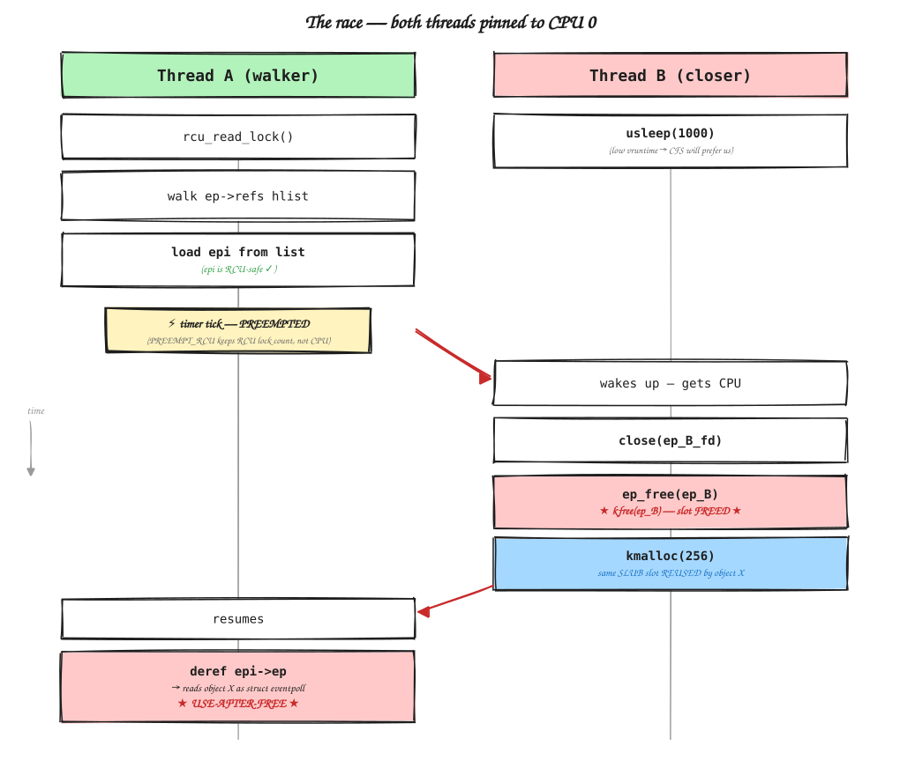

# The Epoll UAF

In early 2026, Nicholas Carlini landed a one-line fix in `fs/eventpoll.c`. [Commit 07712db80857](https://git.kernel.org/pub/scm/linux/kernel/git/stable/linux.git/commit/?id=07712db80857d5d09ae08f3df85a708ecfc3b61f) changed a `kfree()` to `kfree_rcu()`. The commit message says: "eventpoll: defer struct eventpoll free to RCU grace period." That's it.

That one call fixed a use-after-free that had been reachable from any unprivileged process for over a year, on any Linux system running a 6.x kernel with the affected optimization. That includes every Android device running a GKI kernel.

How does it work? How hard is it to trigger on a real device? What can you do with it? And why did a 60% performance improvement create a use-after-free that nobody noticed? I spent a few weeks on a Pixel 10 pulling this apart, and in the process learned more about CFS vruntime tricks, SLUB internals, and the ARM64 memory model than I probably needed to.

---

## epoll, Briefly

If you've run a Linux server you've used epoll indirectly. It's the kernel's scalable I/O notification mechanism -- the thing that lets nginx watch tens of thousands of sockets without blocking a thread per connection. Three syscalls: `epoll_create()` makes an instance, `epoll_ctl()` adds or removes watched file descriptors, `epoll_wait()` blocks until something happens.

Here's the twist: an epoll fd is itself a file descriptor. You can add an epoll to another epoll. This creates a directed graph of instances watching instances, and the kernel has validation code inside `epoll_ctl(ADD)` that walks this graph to check for cycles and depth violations.

That validation code is where the bug lives.

---

## The Structures

Two kernel objects.



**`struct eventpoll`** -- one per `epoll_create()`. Has the wait queue, the RB tree of items being watched, and `refs` at offset 176: an hlist head that links every `epitem` pointing back at this instance from somewhere else. It's the incoming-edges list in the graph.

**`struct epitem`** -- one per (epoll instance, watched fd) pair. Has `epi->ep`, a pointer to its owning `eventpoll`. If the watched fd is itself an epoll, this epitem is also linked into *that* epoll's `refs` hlist via `fllink`.

The graph walker iterates `ep->refs`, follows `epi->ep` for each entry to reach a parent `eventpoll`, and recurses. That `epi->ep` dereference is the UAF.

---

## The 2023 Optimization

Before March 2023, every `epoll_ctl(ADD)` with a nested target acquired a global mutex called `epmutex`. Under HTTP benchmarks, 58% of CPU time was lost to contention on it.

A patch replaced `epmutex` with a per-instance `refcount_t`, added a `dying` flag to `struct epitem`, and narrowed the remaining lock to only be held during actual graph walks. Throughput went up 60%.

The race between the two obvious close paths -- `ep_clear_and_put()` (closing an epoll fd) and `eventpoll_release_file()` (closing a watched fd) -- was carefully audited. It's correctly handled.

But there was a third path. The graph walkers -- `ep_get_upwards_depth_proc` and `reverse_path_check_proc` -- iterate `ep->refs` under `rcu_read_lock()` while other threads tear down the structures they're pointing at. The old `epmutex` had been incidentally serializing this. Nobody noticed, because the walkers don't touch any of the data the mutex was nominally protecting. They just follow pointers through it.

---

## The Bug

Here's the vulnerable function:

```c
static int ep_get_upwards_depth_proc(struct eventpoll *ep, int depth)
{
    int result = 0;
    struct epitem *epi;

    if (ep->gen == loop_check_gen)
        return ep->loop_check_depth;

    hlist_for_each_entry_rcu(epi, &ep->refs, fllink)
        result = max(result, ep_get_upwards_depth_proc(epi->ep, depth + 1) + 1);
                                                       /* ^^^^^^^ */
    ep->gen = loop_check_gen;
    ep->loop_check_depth = result;
    return result;
}
```

It runs under `rcu_read_lock()`. Each `epitem` is safe -- when unlinked, it's freed via `call_rcu()`, so RCU keeps it alive through the read-side critical section. There's even a comment in the source that acknowledges the RCU reader:

```c
/* The rcu read side, reverse_path_check_proc(), does not make
 * use of the rbn field.
 */
call_rcu(&epi->rcu, epi_rcu_free);
```

That comment is correct about the `epitem`. It says nothing about what `epi->ep` points to.

Now look at the teardown path:

```c
static void ep_free(struct eventpoll *ep)
{
    mutex_destroy(&ep->mtx);
    free_uid(ep->user);
    wakeup_source_unregister(ep->ws);
    kfree(ep);
}
```

`kfree()`. Immediate. No RCU grace period.

The walker loads `epi->ep` -- a pointer read, fine -- then dereferences the target. But that `eventpoll` may have already been freed and reused by a completely different `kmalloc-256` allocation.

---

## Triggering It



I initially tried the obvious thing: two threads on different CPUs, one walking the graph, one closing an epoll fd. It doesn't work. The window between loading `epi` from the hlist and following `epi->ep` is a handful of ARM64 instructions. Cache coherence latency across physical cores is wider than the gap.

What does work is same-CPU preemption. The device I was testing on (a Pixel 10, kernel 6.6.102) runs `CONFIG_PREEMPT=y` and `CONFIG_PREEMPT_RCU=y`, which means `rcu_read_lock()` just bumps a per-task counter -- it doesn't disable preemption. A timer tick during the walk can yield the CPU to the closer thread even though the walker is mid-RCU.

The numbers (`CONFIG_HZ=250`, tick every 4 ms):

- 4,096 parents: walk takes ~400 us. Rarely overlaps a tick.
- 8,000 parents: ~2 ms. Overlaps reliably. About 4% hit rate per attempt.

There's a scheduler subtlety I wasted at least a day on. CFS prefers threads with low virtual runtime. If the closer busy-waits for the trigger signal, it accumulates vruntime and CFS actually *deprioritizes* it. The fix is counterintuitive: have the closer call `usleep(1000)` in a loop while waiting. When it wakes, its vruntime is near zero and CFS strongly prefers it over the walker. I only figured this out after dumping the vruntime values and staring at them for a while.

One more thing I didn't expect: the CPU frequency governor matters. The Pixel's default governor throttles to 729 MHz at idle. At that frequency the traversal timing shifts enough that the race stops firing entirely. Setting `performance` mode (2,246 MHz) was required.

---

## What Gets Written

When the walker reaches a freed `eventpoll`, it touches three offsets:

| offset | field              | size | what happens     |
|--------|--------------------|------|------------------|
| 168    | `gen`              | u64  | read, then write `loop_check_gen` |
| 176    | `refs.first`       | ptr  | read as hlist pointer |
| 184    | `loop_check_depth` | u8   | write 0          |

`struct eventpoll` is 200 bytes and lives in `kmalloc-256` (order-1 slabs, 32 objects per slab, `cpu_partial=52` on this device). With `init_on_free=1` -- set via kernel cmdline, interestingly not the config default -- the slot gets zeroed on free.

What's at offset 176 when the walker arrives decides everything:

If it's **zero** (the `init_on_free` case), the hlist looks empty. The walker skips the loop, writes `loop_check_gen` at 168 and a zero byte at 184, returns. Silent corruption of 9 bytes in whatever object reclaimed the slot.

If it's **nonzero**, the walker follows it as a pointer to an `epitem`, computes `container_of()`, dereferences `epi->ep`, and recurses into wherever that points. On garbage, the kernel panics.

If you can reclaim the slot with an object where you control offset 176, you steer the recursion. Each level writes `loop_check_gen` (a global u64 counter that increments per `epoll_ctl(ADD)`) and a zero byte at fixed offsets from the pointer target. That's a constrained but real kernel write primitive. What you do with it from there depends on what `kmalloc-256` object you use for reclaim, and how creative you're feeling.

---

## Can You Cross-Cache This?

Anyone who's read a dirty pagetable writeup is going to ask: can you free the slab page to buddy and reclaim it as a PTE page?

I spent a lot of time trying. Short answer: I couldn't make it work.

`kmalloc-256` uses order-1 slabs (8 KB). ARM64 PTE pages are order-0 (4 KB). These sit on different PCP freelists. The order-1 page freed from the slab cache won't satisfy an order-0 PTE request unless PCP overflows and buddy splits it, and arranging that overflow during the narrow race window turns out to be really hard.

The pieces work in isolation -- I verified this separately. With heap shaping, 244 out of 250 slab pages go to buddy. With 16 children forking and faulting 8 GB each, all available UNMOVABLE order-1 gets split for PTE allocations. The slab-to-buddy transition works. The buddy-to-PTE transition works.

The problem is combining them with the race. The walker finishes in about 2 ms. The full cross-cache pipeline -- SLUB discard, PCP drain, buddy insertion, PTE allocation with `__GFP_ZERO` -- takes on the order of 100 ms. The gen write needs to land on a physical page that has *already* completed the transition from slab to PTE, and those timelines don't overlap. I couldn't find a way to stretch the walk long enough without resorting to `SCHED_FIFO` or similar privileged tricks, which defeats the purpose.

Same-cache reclaim sidesteps this entirely. SLUB's per-CPU freelist is LIFO: last freed, first allocated. An immediate `kmalloc(256)` on the same CPU gets you the exact slot. The hard part is finding a `kmalloc-256` object with a useful layout at offsets 168 and 176.

---

## The Fix

[Commit 07712db80857](https://git.kernel.org/pub/scm/linux/kernel/git/stable/linux.git/commit/?id=07712db80857d5d09ae08f3df85a708ecfc3b61f):

```diff
 static void ep_free(struct eventpoll *ep)
 {
     mutex_destroy(&ep->mtx);
     free_uid(ep->user);
     wakeup_source_unregister(ep->ws);
-    kfree(ep);
+    kfree_rcu(ep, rcu);
 }
```

A `struct rcu_head` is added to `eventpoll`. `kfree_rcu()` defers the free until the RCU grace period ends. Since the walker holds `rcu_read_lock()`, the grace period can't complete until it's done. Simple.

---

## Closing Thoughts

The part of this bug that stays with me isn't the race condition or the allocator internals. It's the amount of work required to understand which code paths in epoll are protected by what. Wait queue locks serialize callbacks. File refcounts gate `ep_free`. `__fput` sequences cleanup. `call_rcu` defers `epitem` frees. Each mechanism covers something. You have to hold all of them in your head at once before you can point at `epi->ep` and be sure that nothing is keeping the target alive. I spent several days just on that part, and I suspect most people who look at the code would give up before getting there.

The 2023 optimization is a clean example of a specific failure mode. The old `epmutex` was overbroad -- that's why removing it gave 60%. But overbroad locks are also incidentally protective. The graph walkers were unintentional beneficiaries. They didn't show up in anyone's audit of the refactoring because they don't touch the data the mutex was nominally guarding. They just follow pointers through structures that the mutex was keeping alive.

I suspect this pattern is more common than we think. When you remove a lock that was held longer than it needed to be, you're not just removing contention. You're removing protection from every code path that was depending on that lock to keep something else alive, whether it knew it or not. Every one of those paths has to be re-audited. Even the ones -- especially the ones -- that don't obviously touch the protected data.

The fix is [upstream](https://git.kernel.org/pub/scm/linux/kernel/git/stable/linux.git/commit/?id=07712db80857d5d09ae08f3df85a708ecfc3b61f). Go update.
